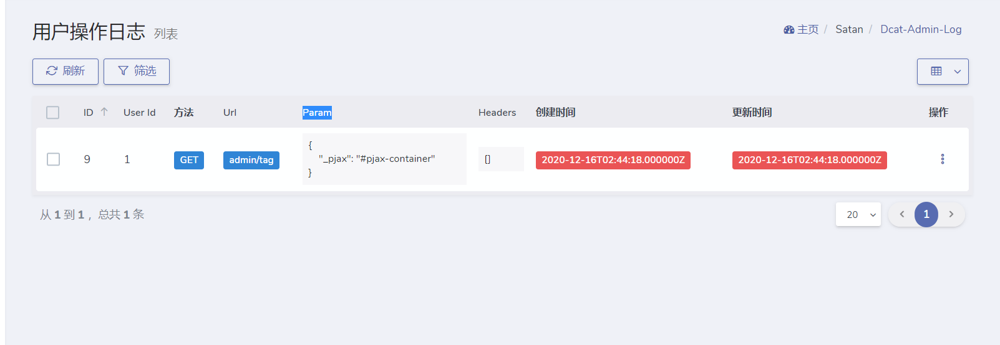
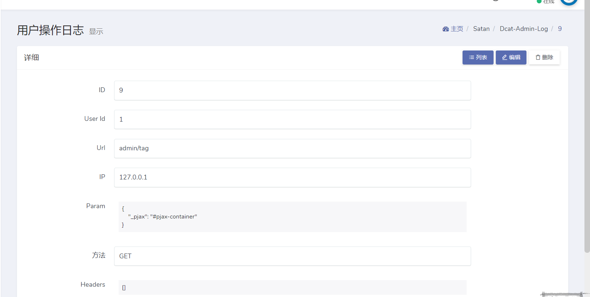

# Dcat Admin Extension
## 日志扩展
## 示例


## 使用方法
-- 在控制器中使用
```php
//引入命名空间
use Dcat\Admin\Satan\Admin\Log\Http\Middleware\LogOperation;
use Dcat\Admin\Http\Controllers\AdminController;

class IndexController extends AdminController
{
    public function __construct() 
    {
        //记录当前控制器所有方法
        $this->middleware(LogOperation::class);
        //只记录index方法 
        $this->middleware(LogOperation::class)
             ->only('index');
        //记录除了login的其他方法
        $this->middleware(LogOperation::class)
            ->except('login');
    }
}
```
-- 在路由文件中使用
```php
# app/Admin/routes.php
use Illuminate\Routing\Router;
use Illuminate\Support\Facades\Route;
use Dcat\Admin\Admin;

Admin::routes();

Route::group([
    'prefix'        => config('admin.route.prefix'),
    'namespace'     => config('admin.route.namespace'),
    'middleware'    => config('admin.route.middleware'),
], function (Router $router) {
    $router->get('/', 'HomeController@index')
           ->middleware(\Dcat\Admin\Satan\Admin\Log\Http\Middleware\LogOperation::class);
    
});
```
-- 全局使用 参考文档laravel官方文档 [为路由分配中间件](https://learnku.com/docs/laravel/8.x/middleware/9366#assigning-middleware-to-routes)
